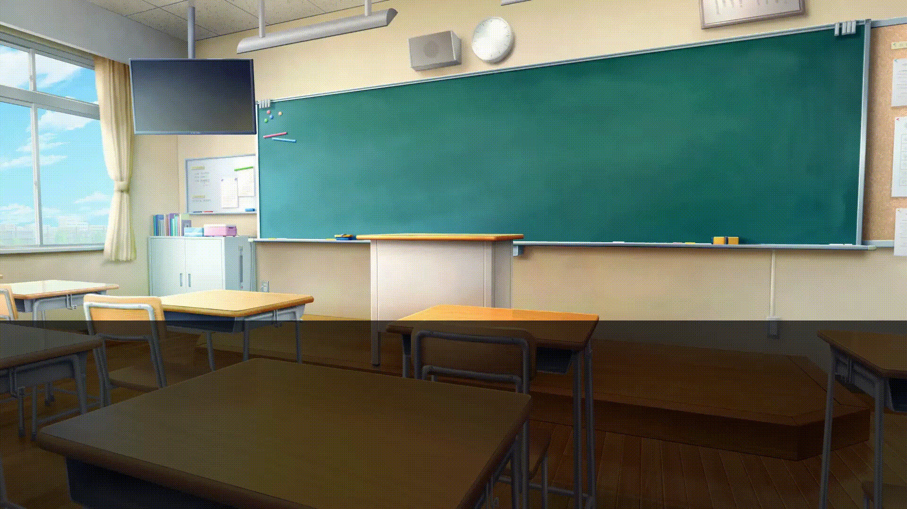

<h4 align="right"><a href="https://github.com/vnve/vnve/blob/main/README.md">English</a> | <strong>简体中文</strong></h4>
<p align="center">
  
</p>
<h1 align="center">V N V E</h1>
<p align="center"><strong>Visual Novel Video Editor</strong></p>
<p align="center"><strong>视觉小说视频编辑器</strong></p>
<p align="center"><strong>在浏览器中制作视觉小说视频 <a href="https://vnve.net"> 🔗 </a></strong></p>
<div align="center">
  <a href="https://discord.gg/sc9jpqBAbs"></a>
  <a href="https://www.npmjs.com/package/@vnve/core"></a>
  
  
</div>

## 特征

- 🔥 AI 赋能快速创作，搭配 DeepSeek、OpenAI 等 API，一键生成视觉小说视频 🆕
- 🎬 为创作视觉小说量身定制的在线视频编辑器，打开浏览器即可开始创作
- 👋 告别复杂的视频剪辑软件，创作视觉小说视频变得简单且快速
- 📝 文字优先，让我们回到视觉小说创作的核心 —— 文字内容
- 🚀 纯前端Typescript实现，核心通过 PixiJS + WebCodecs 驱动
- 🖍️ 也可以通过使用Npm包，去用编程的方式去创作视频
> 👻 定位只是一个为视觉小说量身定制的视频创作工具，假如你想制作分支逻辑、数值等更具游戏性的行为，可以去利用类似b站的[互动视频](https://member.bilibili.com/platform/upload/video/interactive)去实现

## 使用VNVE创作的视频
<table>
<tr>
<td align="center">

<p>视频标题场景</p>
<td align="center">

<p>人物对话场景</p>
</td>
</tr>
</table>

## 用途
- 🪄 低成本制作视觉小说视频，快速把文字内容转换成视频
- 🧩 配合Bilibili的[互动视频](https://member.bilibili.com/platform/upload/video/interactive)，可以实现类似GalGame的游戏效果
- 🎬 制作小说推文视频，视频短剧
- ...

## 在线用法
访问: [vnve.net](https://vnve.net)，立刻开始创作

### 演示视频
https://github.com/user-attachments/assets/10d32b92-4497-4a38-9abf-d921c3da2e9a


## 代码用法
你也可以通过调用npm包来直接创作视频

### 安装
```bash
npm install @vnve/core
```

### 使用
```typescript
import { Creator, Scene, Img, Text, Sound, PREST_ANIMATION } from "@vnve/core";

const creator = new Creator(); // 创作者，负责视频合成

// 场景，视频是由一个个场景组合而成
const scene = new Scene({ duration: 3000 })

// 场景中的元素，文字、图片等
const img = new Img({ source: "图片地址" })
const text = new Text("V N V E", {
  fill: "#ffffff",
  fontSize: 200
})
const sound = new Sound({ source: "音频地址" })

// 把元素加到场景中
scene.addChild(img)
scene.addChild(text)

// 添加音频
scene.addSound(sound)

// 可以给元素加些动画
text.addAnimation(PREST_ANIMATION.FadeIn)

// 把场景提供给创作者，然后开始生成视频
creator.add(scene)
creator.start().then(videoBlob => {
  URL.createObjectURL(videoBlob) // 稍等片刻，你就可以获得一个mp4文件
})
```
[](https://codesandbox.io/s/make-video-programmatically-with-vnve-27z2cv)

### 模版
通过使用封装好的模版，可以更快捷的实现我们想要的视频效果

在使用前，需要额外安装一个包`@vnve/template`

```bash
npm install @vnve/template
```

### 使用模版
```typescript
import { Creator } from "@vnve/core";
import { TitleScene, DialogueScene } from "@vnve/template";

const creator = new Creator();
// 创建一个标题场景
const titleScene = new TitleScene({
  title: "主标题",
  subtitle: "副标题",
  backgroundImgSource: "图片链接",
  soundSources: [{ source: "音频链接" }],
  duration: 3000,
})

// 创建一个对话场景
const dialogueScene = new DialogueScene({
  lines: [
    { name: "角色A", content: "角色A的台词" },
    { name: "角色B", content: "角色B的台词" },
  ],
  backgroundImgSource: "图片链接",
  soundSources: [{ source: "音频链接" }],
});

creator.add(titleScene)
creator.add(dialogueScene)
creator.start().then(videoBlob => {
  URL.createObjectURL(videoBlob) // 稍等片刻，你就可以获得一个mp4文件
})
```
[](https://codesandbox.io/s/make-video-programmatically-with-vnve-template-4j467p)

## 核心模块
| 包名 | 简介 | 文档 |
|  ----  | ----  | ---- |
| @vnve/editor | 在线编辑器的Web UI页面 | 🚧 |
| @vnve/core | 核心模块，利用PixiJS + Webcodes实现场景动态化，并导出Mp4视频 | 🚧 |
| @vnve/template | 模版包，由场景和元素组成，用于场景复用 | 🚧 |

## 证书
MIT
